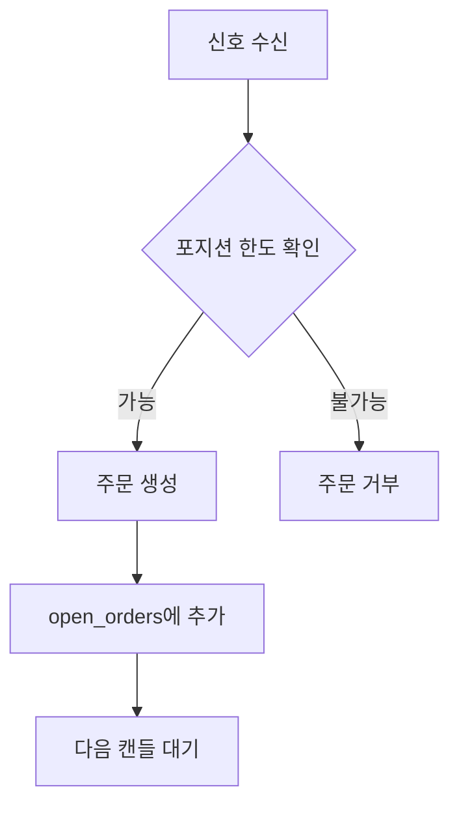
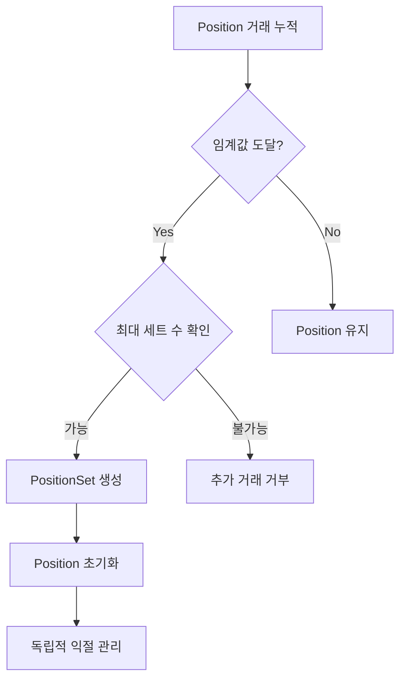
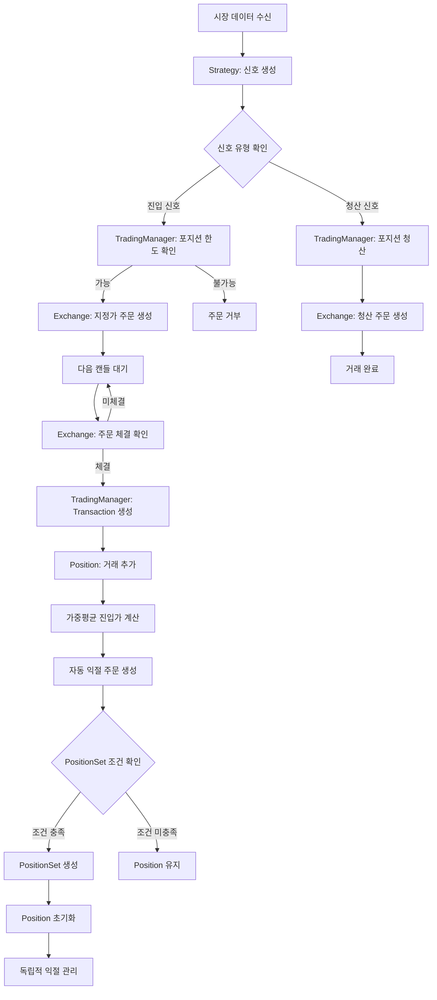

# 포지션 생성 프로세스 분석
## CryptoSim 거래 시스템 심화 분석

---

## 📋 목차

1. [개요](#개요)
2. [시스템 아키텍처](#시스템-아키텍처)
3. [포지션 생성 프로세스](#포지션-생성-프로세스)
4. [핵심 컴포넌트](#핵심-컴포넌트)
5. [상세 프로세스 흐름](#상세-프로세스-흐름)
6. [PositionSet 관리](#positionset-관리)
7. [리스크 관리](#리스크-관리)
8. [코드 분석](#코드-분석)

---

## 개요

CryptoSim의 포지션 생성 프로세스는 **신호 생성 → 주문 생성 → 체결 → 포지션 관리 → 익절 관리**의 완전한 자동화된 거래 시스템입니다.

### 주요 특징
- **Multi-layer 포지션 관리**: Position → PositionSet 구조
- **자동 익절 주문 생성**: 포지션 생성 시 자동으로 익절 주문 설정
- **리스크 관리**: 최대 포지션 수 제한 및 마진 관리
- **실시간 처리**: 백테스트와 실거래 모두 지원

---

## 시스템 아키텍처

```
┌─────────────────┐    ┌─────────────────┐    ┌─────────────────┐
│   Strategy      │    │ TradingManager  │    │   Exchange      │
│   (신호 생성)   │───▶│   (거래 관리)   │───▶│   (주문 처리)   │
└─────────────────┘    └─────────────────┘    └─────────────────┘
                                │
                                ▼
                       ┌─────────────────┐
                       │ PositionManager │
                       │   (포지션 관리) │
                       └─────────────────┘
                                │
                                ▼
                       ┌─────────────────┐
                       │TransactionManager│
                       │   (거래 관리)   │
                       └─────────────────┘
```

---

## 포지션 생성 프로세스

### 1단계: 신호 생성
```python
# src/strategy.py - SMACrossoverStrategy
def generate_signals(self, df: pd.DataFrame) -> pd.DataFrame:
    """거래 신호 생성"""
    # 지표 계산 (SMA, 골든크로스 등)
    df = self.calculate_indicators(df)
    
    # 신호 판단
    # 1: 롱 진입, -1: 숏 진입, 2: 롱 청산, -2: 숏 청산
    if (골든크로스 & 상승추세 & 가격하락):
        signal = 1  # 롱 진입
    elif (데드크로스 & 하락추세 & 가격상승):
        signal = -1  # 숏 진입
```

### 2단계: 신호 처리
```python
# src/trading_manager.py - TradingManager
def process_signal(self, signal_data: Dict):
    """신호를 받아 주문 생성"""
    signal = signal_data.get('signal', 0)
    
    if signal == 1:  # 롱 진입
        # 포지션 한도 확인
        if self._check_position_limits(PositionSide.LONG):
            # 지정가 주문 생성
            order = self.exchange.create_limit_order(...)
            self.open_orders.append(order)
```

---

## 핵심 컴포넌트

### Transaction (거래 단위)
```python
@dataclass
class Transaction:
    """개별 거래 정보"""
    id: str
    symbol: str
    side: PositionSide  # LONG/SHORT
    amount: float       # 수량 (BTC)
    entry_price: float  # 진입가
    margin: float       # 마진 (BTC)
    leverage: float     # 레버리지
    entry_time: datetime
    # ... 기타 필드들
```

### Position (포지션 집계)
```python
@dataclass
class Position:
    """같은 방향의 거래들 집계"""
    side: PositionSide
    total_amount: float         # 총 수량
    weighted_avg_price: float   # 가중평균 진입가
    transaction_ids: List[str]  # 포함된 거래 ID들
    take_profit_order_id: str   # 익절 주문 ID
```

### PositionSet (포지션 세트)
```python
@dataclass
class PositionSet:
    """분리 관리되는 포지션 그룹"""
    id: str
    side: PositionSide
    total_amount: float
    avg_entry_price: float
    created_time: datetime
    # 독립적인 익절 관리
```

---

## 상세 프로세스 흐름

### 1. 주문 생성


### 2. 주문 체결
```python
# src/virtual_exchange.py - VirtualExchange
def process_candle_for_orders(self, candle_data: Dict):
    """캔들 데이터로 주문 체결 확인"""
    for order in self.open_orders:
        # 매수 주문: 지정가 <= 캔들 저가
        if order_price >= current_low:
            order['status'] = 'closed'
            filled_orders.append(order)
```

### 3. 포지션 생성
```python
# src/trading_manager.py - TradingManager
def _handle_entry_order(self, filled_order: Dict):
    """체결된 진입 주문 처리"""
    # 1. Transaction 생성
    transaction = Transaction.from_ccxt_order(filled_order, position_side)
    
    # 2. 포지션에 추가
    position = self.positions[transaction.side]
    position.add_transaction(transaction)
    
    # 3. 익절 주문 생성
    self._update_take_profit_order(position, timestamp)
    
    # 4. PositionSet 조건 확인
    if len(position.transaction_ids) == self.position_set_size_threshold:
        self._create_position_set(position)
```

---

## PositionSet 관리

### 생성 조건
- **거래 수량**: 설정된 임계값 도달 (예: 10개)
- **최대 세트 수**: 롱 3개, 숏 2개 제한
- **자동 분리**: 조건 충족 시 Position → PositionSet 이동

### 관리 프로세스


### 코드 예시
```python
# PositionSet 생성 로직
if len(position.transaction_ids) == self.position_set_size_threshold:
    if len(current_sets) < max_sets:
        # 새로운 PositionSet 생성
        new_set = PositionSet(
            id=str(uuid.uuid4()),
            side=transaction.side,
            transaction_ids=list(position.transaction_ids),
            total_amount=total_amount_for_set,
            avg_entry_price=avg_price_for_set,
            created_time=transaction.entry_time
        )
        # Position 초기화
        position.transaction_ids.clear()
        position.total_amount = 0.0
```

---

## 리스크 관리

### 포지션 크기 제한
```python
# 최대 포지션 수 확인
if len(self.long_position_sets) >= self.max_long_sets and \
   len(self.positions[PositionSide.LONG].transaction_ids) >= (self.position_set_size_threshold-1):
    self.logger.warning("최대 롱 포지션 한도 도달")
    return
```

### 마진 관리
```python
# 마진 확인
if margin > self.current_balance:
    self.logger.warning(f"마진 부족: 필요 {margin:.6f} BTC")
    return
```

### 자동 익절 주문
```python
def _update_take_profit_order(self, position_or_set, timestamp):
    """익절 주문 자동 생성/업데이트"""
    # 기존 주문 취소
    if existing_order_id:
        self.exchange.cancel_order(existing_order_id)
    
    # 새 익절 가격 계산
    if side == PositionSide.LONG:
        exit_price = avg_price * (1 + self.take_profit_pct)
    else:
        exit_price = avg_price * (1 - self.take_profit_pct)
    
    # 익절 주문 생성
    tp_order = self.exchange.create_limit_order(...)
```

---

## 코드 분석

### 주요 파일별 역할

#### 1. `src/trading_manager.py`
- **핵심 역할**: 거래 총괄 관리
- **주요 메서드**:
  - `process_signal()`: 신호 처리
  - `_handle_entry_order()`: 진입 주문 처리
  - `_update_take_profit_order()`: 익절 주문 관리

#### 2. `src/models.py`
- **핵심 역할**: 데이터 모델 정의
- **주요 클래스**:
  - `Transaction`: 개별 거래
  - `Position`: 포지션 집계
  - `PositionSet`: 포지션 세트

#### 3. `src/virtual_exchange.py`
- **핵심 역할**: 가상 거래소 (백테스트)
- **주요 메서드**:
  - `process_candle_for_orders()`: 주문 체결 처리
  - `create_limit_order()`: 지정가 주문 생성

#### 4. `src/strategy.py`
- **핵심 역할**: 거래 전략 및 신호 생성
- **주요 메서드**:
  - `generate_signals()`: 신호 생성
  - `calculate_position_size()`: 포지션 크기 계산

---

## 프로세스 흐름도



---

## 핵심 포인트

### 1. 계층적 포지션 관리
- **Level 1**: Transaction (개별 거래)
- **Level 2**: Position (같은 방향 거래 집계)
- **Level 3**: PositionSet (독립 관리 그룹)

### 2. 자동화된 리스크 관리
- 포지션 크기 제한
- 마진 사전 확인
- 자동 익절 주문 생성

### 3. 실시간 처리
- 캔들 단위 주문 체결 확인
- 즉시 포지션 업데이트
- 동적 익절 주문 관리

### 4. 확장 가능한 구조
- 전략 독립적 설계
- 백테스트/실거래 공통 인터페이스
- 모듈화된 컴포넌트

---

## 결론

CryptoSim의 포지션 생성 프로세스는 **완전 자동화된 거래 시스템**으로, 신호 생성부터 포지션 관리까지 모든 과정이 체계적으로 관리됩니다. 

특히 **PositionSet 관리**를 통한 리스크 분산과 **자동 익절 주문 생성**을 통한 수익 보호가 핵심 특징입니다.

### 시스템의 장점
- ✅ 완전 자동화
- ✅ 체계적인 리스크 관리
- ✅ 실시간 처리
- ✅ 확장 가능한 구조

### 개선 가능 영역
- 🔄 동적 포지션 크기 조절
- 🔄 더 정교한 진입/청산 로직
- 🔄 다양한 익절/손절 전략 지원 